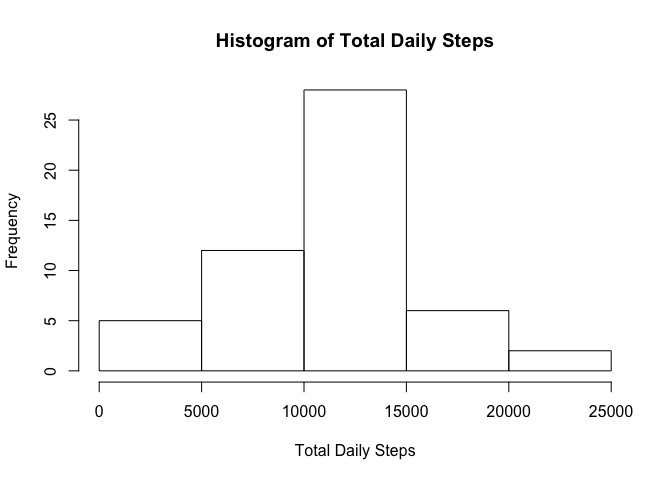
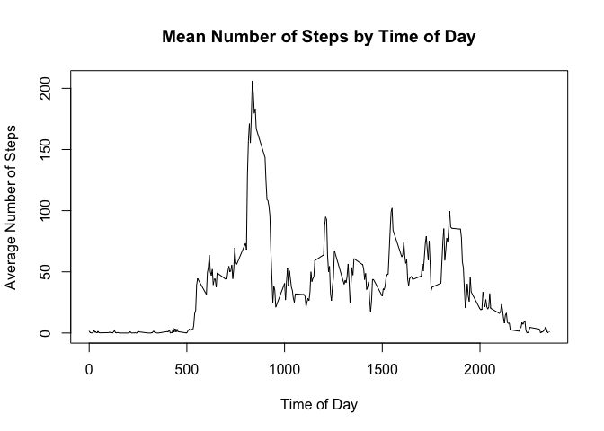
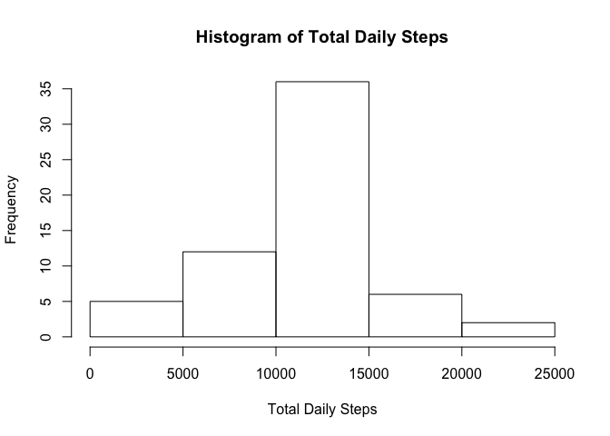
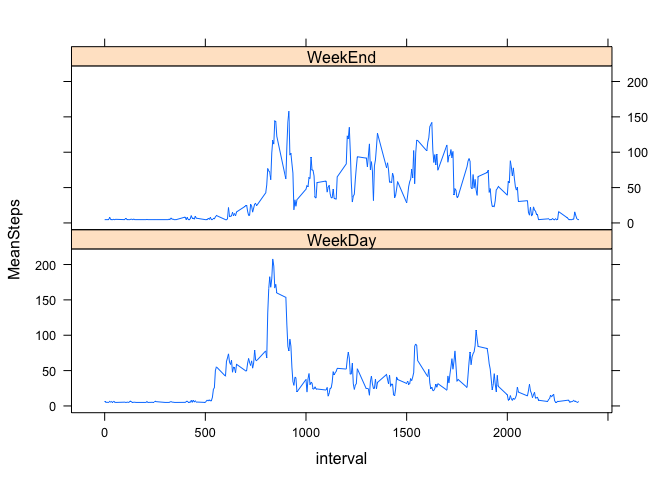

#       Reproducible Research:  Peer Assessment 1

## Loading and preprocessing the data

The software was downloaded from the course website as a file "activity.csv"
After reading in the data:

1. Change the date into a Date Object

2. Convert into a data table


```r
activity_RawData <- read.csv("activity.csv")
activity_RawData$date <- as.Date(activity_RawData$date)

library(data.table)
DT = data.table(activity_RawData)
```

### Create a data table where the NA values are removed.


```r
DT_Clean = DT[(!(is.na(DT$steps))),]
```

### Copy the original data into a new table that will be used with imputed data


```r
DT_Imputed = DT
```

### This is the data that will be used for the first part of the assignment.

Now that there are all of the values needed, create a data frame where
only the complete cases are to be used (no NA values).


```r
DailySteps <- DT_Clean[,list(TotalSteps=sum(steps)),by="date"]
```

## What is mean total number of steps taken per day?

```r
hist(DailySteps$TotalSteps,
     main = "Histogram of Total Daily Steps",
     xlab = "Total Daily Steps")
```

 

```r
SummaryDailySteps <- DailySteps[,list(MEAN = mean(TotalSteps),
                                      MEDIAN = median(TotalSteps))]
SummaryDailySteps
```

```
##        MEAN MEDIAN
## 1: 10766.19  10765
```

## What is the average daily activity pattern?
Want to get the average for each value of the index.  The index value appears
to be a start time for the five minute intervals in the data.

```r
AverageStepsPeriod <- DT_Clean[,list(MeanSteps=mean(steps)),by="interval"]
plot(AverageStepsPeriod,
     typ="l",main="Mean Number of Steps by Time of Day",
     xlab = "Time of Day", ylab = "Average Number of Steps")
```

 

### Which 5 minute interval had the most average steps?

```r
most <- AverageStepsPeriod[AverageStepsPeriod$MeanSteps == 
                                   max(AverageStepsPeriod$MeanSteps)]
most
```

```
##    interval MeanSteps
## 1:      835  206.1698
```
## Imputing missing values

### Calculate and report total number of rows with missing values

Going to start with the data table, DT_Imputed, which is just a copy of DT:


```r
colSums(is.na(DT_Imputed))
```

```
##    steps     date interval 
##     2304        0        0
```

### Replacing all of the NA values with the Average Daily Steps for the same time interval.


```r
AverageStepsPerInterval <- mean(AverageStepsPeriod$MeanSteps)
imputedValue <- function(interval) {
        AverageStepsPerInterval
}

DT_Imputed[,ImputedSteps:=as.numeric(steps)]
```

```
##        steps       date interval ImputedSteps
##     1:    NA 2012-10-01        0           NA
##     2:    NA 2012-10-01        5           NA
##     3:    NA 2012-10-01       10           NA
##     4:    NA 2012-10-01       15           NA
##     5:    NA 2012-10-01       20           NA
##    ---                                       
## 17564:    NA 2012-11-30     2335           NA
## 17565:    NA 2012-11-30     2340           NA
## 17566:    NA 2012-11-30     2345           NA
## 17567:    NA 2012-11-30     2350           NA
## 17568:    NA 2012-11-30     2355           NA
```

```r
DT_Imputed[is.na(DT_Imputed$steps),
           ImputedSteps:= imputedValue(DT_Imputed$interval)]
```

```
##        steps       date interval ImputedSteps
##     1:    NA 2012-10-01        0      37.3826
##     2:    NA 2012-10-01        5      37.3826
##     3:    NA 2012-10-01       10      37.3826
##     4:    NA 2012-10-01       15      37.3826
##     5:    NA 2012-10-01       20      37.3826
##    ---                                       
## 17564:    NA 2012-11-30     2335      37.3826
## 17565:    NA 2012-11-30     2340      37.3826
## 17566:    NA 2012-11-30     2345      37.3826
## 17567:    NA 2012-11-30     2350      37.3826
## 17568:    NA 2012-11-30     2355      37.3826
```

```r
colSums(is.na(DT_Imputed))
```

```
##        steps         date     interval ImputedSteps 
##         2304            0            0            0
```

### Make a histogram of the total number of steps taken

```r
DailySteps_Imputed <- DT_Imputed[,list(TotalSteps=sum(ImputedSteps)),by="date"]

hist(DailySteps_Imputed$TotalSteps,
     main = "Histogram of Total Daily Steps",
     xlab = "Total Daily Steps")
```

 

### Calculate the mean and median total number of steps

```r
SummaryDailySteps_Imputed <- DailySteps_Imputed[,list(
        MEAN = mean(TotalSteps),
        MEDIAN = median(TotalSteps))]
SummaryDailySteps_Imputed
```

```
##        MEAN   MEDIAN
## 1: 10766.19 10766.19
```

### Compare these answers to the data with the NA values removed

The mean for without using the records with missing data is 10766.19  and the mean with the imputed values is 10766.19.

The median for without using the records with missing data is 10765 and the median with the imputed values is 10766.19.

### What is the impact of imputing missing data on these estimates?

Since using the average steps per interval, the average steps per day did not change.  Since there are more values with the average number of steps, the median changed to be closer to the average.

## Are there differences in activity patterns between weekdays and weekends?

### Create a new factor variable in the dataset with the two levels for "weekday" and "weekend"


```r
library(lubridate)
```

```
## 
## Attaching package: 'lubridate'
## 
## The following objects are masked from 'package:data.table':
## 
##     hour, mday, month, quarter, wday, week, yday, year
```

```r
WeekendData <- DT_Imputed[, dayType:=factor(ifelse(wday(date) %in% c(1,7),
                                           "weekend",
                                           "weekday"))]

DT_WeekDay <- DT_Imputed[DT$dayType=="weekday"]
AverageWeekDaySteps <- DT_WeekDay[,list(MeanSteps=mean(ImputedSteps)),
                                  by="interval"]
DT_WeekEnd <- DT_Imputed[DT$dayType=="weekend"]
AverageWeekEndSteps <- DT_WeekEnd[,list(MeanSteps=mean(ImputedSteps)),
                                  by="interval"]
```

### Make a panel plot for the time series of the 5 minute intervals (x-axis) and the average number of steps taken on the (y-axis) with one panel for weekdays and one for weekends


```r
Result <- rbind(AverageWeekDaySteps[,type:="WeekDay"],
                AverageWeekEndSteps[,type:="WeekEnd"])

library(lattice)
xyplot(MeanSteps ~ interval | type, data = Result, 
       layout = c(1,2), type="l")
```

 

# Supplemental Information

### Session Information


```r
Sys.time()
```

```
## [1] "2015-01-17 10:02:04 CST"
```

```r
tables()
```

```
##       NAME                        NROW MB
##  [1,] AverageStepsPeriod           288 1 
##  [2,] AverageWeekDaySteps          288 1 
##  [3,] AverageWeekEndSteps          288 1 
##  [4,] DailySteps                    53 1 
##  [5,] DailySteps_Imputed            61 1 
##  [6,] DT                        17,568 1 
##  [7,] DT_Clean                  15,264 1 
##  [8,] DT_Imputed                17,568 1 
##  [9,] DT_WeekDay                12,960 1 
## [10,] DT_WeekEnd                 4,608 1 
## [11,] most                           1 1 
## [12,] Result                       576 1 
## [13,] SummaryDailySteps              1 1 
## [14,] SummaryDailySteps_Imputed      1 1 
## [15,] WeekendData               17,568 1 
##       COLS                                     KEY
##  [1,] interval,MeanSteps                          
##  [2,] interval,MeanSteps,type                     
##  [3,] interval,MeanSteps,type                     
##  [4,] date,TotalSteps                             
##  [5,] date,TotalSteps                             
##  [6,] steps,date,interval,ImputedSteps,dayType    
##  [7,] steps,date,interval                         
##  [8,] steps,date,interval,ImputedSteps,dayType    
##  [9,] steps,date,interval,ImputedSteps,dayType    
## [10,] steps,date,interval,ImputedSteps,dayType    
## [11,] interval,MeanSteps                          
## [12,] interval,MeanSteps,type                     
## [13,] MEAN,MEDIAN                                 
## [14,] MEAN,MEDIAN                                 
## [15,] steps,date,interval,ImputedSteps,dayType    
## Total: 15MB
```

```r
sessionInfo()
```

```
## R version 3.1.2 (2014-10-31)
## Platform: x86_64-apple-darwin10.8.0 (64-bit)
## 
## locale:
## [1] en_US.UTF-8/en_US.UTF-8/en_US.UTF-8/C/en_US.UTF-8/en_US.UTF-8
## 
## attached base packages:
## [1] stats     graphics  grDevices utils     datasets  methods   base     
## 
## other attached packages:
## [1] lattice_0.20-29  lubridate_1.3.3  data.table_1.9.2
## 
## loaded via a namespace (and not attached):
##  [1] digest_0.6.8    evaluate_0.5.5  formatR_1.0     grid_3.1.2     
##  [5] htmltools_0.2.6 knitr_1.8       memoise_0.2.1   plyr_1.8.1     
##  [9] Rcpp_0.11.3     reshape2_1.4.1  rmarkdown_0.4.2 stringr_0.6.2  
## [13] tools_3.1.2     yaml_2.1.13
```
